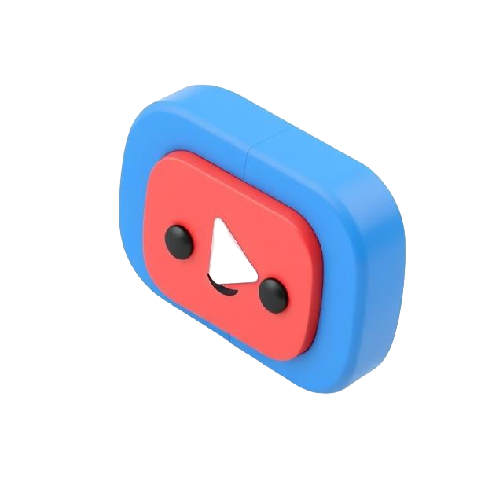

# youFetch - A React App for Downloading YouTube Videos

youFetch is a user-friendly React application that allows users to download YouTube videos easily. Simply paste the YouTube video link, and youFetch does the rest. Designed with simplicity and performance in mind, this app is perfect for anyone who wants to save their favorite YouTube videos offline.

---

## Features
- **Easy-to-Use Interface:** A clean and intuitive UI for seamless interaction.
- **Multiple Formats & Resolutions:** Supports video downloads in various formats and resolutions (based on availability).
- **Fast Processing:** Efficient and quick video processing for hassle-free downloads.
- **Secure Downloads:** Ensures user privacy and secure data handling.

---

## Getting Started
This project was bootstrapped with [Create React App](https://github.com/facebook/create-react-app).

### Prerequisites
- Node.js and npm installed on your machine.
- A YouTube video link for testing.

### Installation
1. Clone the repository:
   ```bash
   git clone https://github.com/yourusername/youfetch.git
   ```
2. Navigate to the project directory:
   ```bash
   cd youfetch
   ```
3. Install dependencies:
   ```bash
   npm install
   ```

---

## Available Scripts

### `npm start`
Runs the app in development mode. Open [http://localhost:3000](http://localhost:3000) to view it in your browser. The page reloads when you make changes, and lint errors are displayed in the console.

### `npm test`
Launches the test runner in interactive watch mode. See more about [running tests](https://facebook.github.io/create-react-app/docs/running-tests).

### `npm run build`
Builds the app for production in the `build` folder. The app is optimized for the best performance and ready for deployment. See [deployment](https://facebook.github.io/create-react-app/docs/deployment) for more details.

### `npm run eject`
This command copies configuration files and transitive dependencies into the project folder for full customization. Use with caution as it is a one-way operation.

---

## Learn More
- [React Documentation](https://reactjs.org/)
- [Create React App Documentation](https://facebook.github.io/create-react-app/docs/getting-started)

## Contributions
Contributions, issues, and feature requests are welcome! Feel free to open a pull request or issue to improve youFetch.

---

### License
This project is licensed under the MIT License - see the LICENSE file for details.

---

### Acknowledgements
- Logo design inspiration from 3D elements.
- Built using [React](https://reactjs.org/) and [Create React App](https://github.com/facebook/create-react-app).
